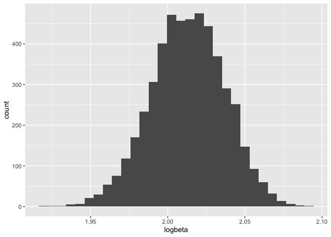
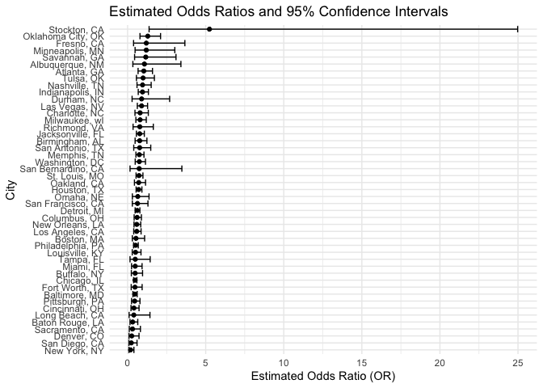

p8105_hw6_yy3563
================
Yifei Yu
2024-11-20

``` r
library(tidyverse)
```

    ## ── Attaching core tidyverse packages ──────────────────────── tidyverse 2.0.0 ──
    ## ✔ dplyr     1.1.4     ✔ readr     2.1.5
    ## ✔ forcats   1.0.0     ✔ stringr   1.5.1
    ## ✔ ggplot2   3.5.1     ✔ tibble    3.2.1
    ## ✔ lubridate 1.9.3     ✔ tidyr     1.3.1
    ## ✔ purrr     1.0.2     
    ## ── Conflicts ────────────────────────────────────────── tidyverse_conflicts() ──
    ## ✖ dplyr::filter() masks stats::filter()
    ## ✖ dplyr::lag()    masks stats::lag()
    ## ℹ Use the conflicted package (<http://conflicted.r-lib.org/>) to force all conflicts to become errors

``` r
library(broom)
library(modelr)
```

    ## 
    ## Attaching package: 'modelr'
    ## 
    ## The following object is masked from 'package:broom':
    ## 
    ##     bootstrap

## Problem 1

``` r
weather_df = 
  rnoaa::meteo_pull_monitors(
    c("USW00094728"),
    var = c("PRCP", "TMIN", "TMAX"), 
    date_min = "2017-01-01",
    date_max = "2017-12-31") %>%
  mutate(
    name = recode(id, USW00094728 = "CentralPark_NY"),
    tmin = tmin / 10,
    tmax = tmax / 10) %>%
  select(name, id, everything())
```

    ## using cached file: /Users/fifi/Library/Caches/org.R-project.R/R/rnoaa/noaa_ghcnd/USW00094728.dly

    ## date created (size, mb): 2024-10-29 11:14:02.944452 (8.656)

    ## file min/max dates: 1869-01-01 / 2024-10-31

``` r
set.seed(123)
boot_sample = function(df) {
  
  boot_df = 
    sample_frac(df, replace = TRUE) 
  
  return(boot_df)
  
  }
boot_straps =
  tibble(
    strap_number = 1:5000
  ) |> 
  mutate(
    strap_sample = map(strap_number, \(i) boot_sample(df = weather_df)),
    models = map(strap_sample, \(strap_df) lm(tmax ~ tmin, data = strap_df)),
    results = map(models, broom::tidy),
    results2 = map(models, broom::glance)
  )

boot_results =
  boot_straps |> 
  select(strap_number, results, results2) |> 
  unnest(results2) |> 
  select(strap_number, r.squared, results) |> 
  unnest(results) |> 
  group_by(strap_number, r.squared) |> 
  summarize(logbeta=log(prod(estimate)), .groups="drop")
```

``` r
boot_results |> 
  ggplot(aes(x = r.squared)) + 
  geom_histogram()
```

    ## `stat_bin()` using `bins = 30`. Pick better value with `binwidth`.

<!-- -->

``` r
boot_results |> 
  ggplot(aes(x = logbeta)) +
  geom_histogram()
```

    ## `stat_bin()` using `bins = 30`. Pick better value with `binwidth`.

<!-- -->

Both distributions are approximate normal. These distributions indicate
a reliable linear relationship between `tmin` and `tmax`, both in terms
of explained variance and the model coefficients.

``` r
boot_results |> 
  summarize(
    boot_est = mean(r.squared),
    boot_se = sd(r.squared),
    boot_ci_ll = quantile(r.squared, 0.025),
    boot_ci_ul = quantile(r.squared, 0.975)
  )
```

    ## # A tibble: 1 × 4
    ##   boot_est boot_se boot_ci_ll boot_ci_ul
    ##      <dbl>   <dbl>      <dbl>      <dbl>
    ## 1    0.912 0.00848      0.895      0.927

The 95% confidence interval for the $r^2$ is (0.895, 0.927).

``` r
boot_results |> 
  summarize(
    boot_est = mean(logbeta),
    boot_se = sd(logbeta),
    boot_ci_ll = quantile(logbeta, 0.025),
    boot_ci_ul = quantile(logbeta, 0.975)
  )
```

    ## # A tibble: 1 × 4
    ##   boot_est boot_se boot_ci_ll boot_ci_ul
    ##      <dbl>   <dbl>      <dbl>      <dbl>
    ## 1     2.01  0.0240       1.96       2.06

The 95% confidence interval for the
$log(\hat{\beta_0}\cdot\hat{\beta}_1)$ is (1.96, 2.06).

## Problem 2

``` r
library(tidyverse)
data = read_csv("data/homicide-data.csv")
```

    ## Rows: 52179 Columns: 12
    ## ── Column specification ────────────────────────────────────────────────────────
    ## Delimiter: ","
    ## chr (9): uid, victim_last, victim_first, victim_race, victim_age, victim_sex...
    ## dbl (3): reported_date, lat, lon
    ## 
    ## ℹ Use `spec()` to retrieve the full column specification for this data.
    ## ℹ Specify the column types or set `show_col_types = FALSE` to quiet this message.

``` r
data = data |> 
  mutate(city_state=paste0(city, ", ", state)) |> 
  filter(!city_state %in% c("Dallas, TX", "Phoenix, AZ", 
                            "Kansas city, MO",
                           "Tulsa, AL")) |> 
  filter(victim_race %in% c("Black", "White")) |> 

   mutate(solved = ifelse(disposition == "Closed by arrest", 1, 0)) |> 
  filter(!is.na(victim_age), 
         !is.na(solved),
         !is.na(victim_sex),
         !is.na(victim_race)
         )
```

``` r
library(broom)
model1 = glm(solved ~ victim_age + victim_sex + victim_race, 
              subset(data, city_state == "Baltimore, MD"),
              family="binomial")
tidy_model = tidy(model1, conf.int = TRUE)
```

    ## Warning: glm.fit: fitted probabilities numerically 0 or 1 occurred
    ## Warning: glm.fit: fitted probabilities numerically 0 or 1 occurred
    ## Warning: glm.fit: fitted probabilities numerically 0 or 1 occurred
    ## Warning: glm.fit: fitted probabilities numerically 0 or 1 occurred
    ## Warning: glm.fit: fitted probabilities numerically 0 or 1 occurred
    ## Warning: glm.fit: fitted probabilities numerically 0 or 1 occurred
    ## Warning: glm.fit: fitted probabilities numerically 0 or 1 occurred
    ## Warning: glm.fit: fitted probabilities numerically 0 or 1 occurred
    ## Warning: glm.fit: fitted probabilities numerically 0 or 1 occurred
    ## Warning: glm.fit: fitted probabilities numerically 0 or 1 occurred
    ## Warning: glm.fit: fitted probabilities numerically 0 or 1 occurred
    ## Warning: glm.fit: fitted probabilities numerically 0 or 1 occurred
    ## Warning: glm.fit: fitted probabilities numerically 0 or 1 occurred
    ## Warning: glm.fit: fitted probabilities numerically 0 or 1 occurred
    ## Warning: glm.fit: fitted probabilities numerically 0 or 1 occurred
    ## Warning: glm.fit: fitted probabilities numerically 0 or 1 occurred
    ## Warning: glm.fit: fitted probabilities numerically 0 or 1 occurred
    ## Warning: glm.fit: fitted probabilities numerically 0 or 1 occurred
    ## Warning: glm.fit: fitted probabilities numerically 0 or 1 occurred
    ## Warning: glm.fit: fitted probabilities numerically 0 or 1 occurred
    ## Warning: glm.fit: fitted probabilities numerically 0 or 1 occurred
    ## Warning: glm.fit: fitted probabilities numerically 0 or 1 occurred
    ## Warning: glm.fit: fitted probabilities numerically 0 or 1 occurred
    ## Warning: glm.fit: fitted probabilities numerically 0 or 1 occurred
    ## Warning: glm.fit: fitted probabilities numerically 0 or 1 occurred
    ## Warning: glm.fit: fitted probabilities numerically 0 or 1 occurred
    ## Warning: glm.fit: fitted probabilities numerically 0 or 1 occurred
    ## Warning: glm.fit: fitted probabilities numerically 0 or 1 occurred
    ## Warning: glm.fit: fitted probabilities numerically 0 or 1 occurred
    ## Warning: glm.fit: fitted probabilities numerically 0 or 1 occurred
    ## Warning: glm.fit: fitted probabilities numerically 0 or 1 occurred
    ## Warning: glm.fit: fitted probabilities numerically 0 or 1 occurred
    ## Warning: glm.fit: fitted probabilities numerically 0 or 1 occurred
    ## Warning: glm.fit: fitted probabilities numerically 0 or 1 occurred
    ## Warning: glm.fit: fitted probabilities numerically 0 or 1 occurred
    ## Warning: glm.fit: fitted probabilities numerically 0 or 1 occurred
    ## Warning: glm.fit: fitted probabilities numerically 0 or 1 occurred
    ## Warning: glm.fit: fitted probabilities numerically 0 or 1 occurred
    ## Warning: glm.fit: fitted probabilities numerically 0 or 1 occurred
    ## Warning: glm.fit: fitted probabilities numerically 0 or 1 occurred
    ## Warning: glm.fit: fitted probabilities numerically 0 or 1 occurred
    ## Warning: glm.fit: fitted probabilities numerically 0 or 1 occurred
    ## Warning: glm.fit: fitted probabilities numerically 0 or 1 occurred
    ## Warning: glm.fit: fitted probabilities numerically 0 or 1 occurred
    ## Warning: glm.fit: fitted probabilities numerically 0 or 1 occurred
    ## Warning: glm.fit: fitted probabilities numerically 0 or 1 occurred
    ## Warning: glm.fit: fitted probabilities numerically 0 or 1 occurred
    ## Warning: glm.fit: fitted probabilities numerically 0 or 1 occurred
    ## Warning: glm.fit: fitted probabilities numerically 0 or 1 occurred
    ## Warning: glm.fit: fitted probabilities numerically 0 or 1 occurred
    ## Warning: glm.fit: fitted probabilities numerically 0 or 1 occurred
    ## Warning: glm.fit: fitted probabilities numerically 0 or 1 occurred
    ## Warning: glm.fit: fitted probabilities numerically 0 or 1 occurred
    ## Warning: glm.fit: fitted probabilities numerically 0 or 1 occurred
    ## Warning: glm.fit: fitted probabilities numerically 0 or 1 occurred
    ## Warning: glm.fit: fitted probabilities numerically 0 or 1 occurred
    ## Warning: glm.fit: fitted probabilities numerically 0 or 1 occurred
    ## Warning: glm.fit: fitted probabilities numerically 0 or 1 occurred
    ## Warning: glm.fit: fitted probabilities numerically 0 or 1 occurred
    ## Warning: glm.fit: fitted probabilities numerically 0 or 1 occurred
    ## Warning: glm.fit: fitted probabilities numerically 0 or 1 occurred
    ## Warning: glm.fit: fitted probabilities numerically 0 or 1 occurred
    ## Warning: glm.fit: fitted probabilities numerically 0 or 1 occurred
    ## Warning: glm.fit: fitted probabilities numerically 0 or 1 occurred
    ## Warning: glm.fit: fitted probabilities numerically 0 or 1 occurred
    ## Warning: glm.fit: fitted probabilities numerically 0 or 1 occurred
    ## Warning: glm.fit: fitted probabilities numerically 0 or 1 occurred
    ## Warning: glm.fit: fitted probabilities numerically 0 or 1 occurred
    ## Warning: glm.fit: fitted probabilities numerically 0 or 1 occurred
    ## Warning: glm.fit: fitted probabilities numerically 0 or 1 occurred
    ## Warning: glm.fit: fitted probabilities numerically 0 or 1 occurred
    ## Warning: glm.fit: fitted probabilities numerically 0 or 1 occurred
    ## Warning: glm.fit: fitted probabilities numerically 0 or 1 occurred
    ## Warning: glm.fit: fitted probabilities numerically 0 or 1 occurred
    ## Warning: glm.fit: fitted probabilities numerically 0 or 1 occurred
    ## Warning: glm.fit: fitted probabilities numerically 0 or 1 occurred
    ## Warning: glm.fit: fitted probabilities numerically 0 or 1 occurred
    ## Warning: glm.fit: fitted probabilities numerically 0 or 1 occurred
    ## Warning: glm.fit: fitted probabilities numerically 0 or 1 occurred
    ## Warning: glm.fit: fitted probabilities numerically 0 or 1 occurred
    ## Warning: glm.fit: fitted probabilities numerically 0 or 1 occurred
    ## Warning: glm.fit: fitted probabilities numerically 0 or 1 occurred
    ## Warning: glm.fit: fitted probabilities numerically 0 or 1 occurred
    ## Warning: glm.fit: fitted probabilities numerically 0 or 1 occurred
    ## Warning: glm.fit: fitted probabilities numerically 0 or 1 occurred
    ## Warning: glm.fit: fitted probabilities numerically 0 or 1 occurred
    ## Warning: glm.fit: fitted probabilities numerically 0 or 1 occurred
    ## Warning: glm.fit: fitted probabilities numerically 0 or 1 occurred
    ## Warning: glm.fit: fitted probabilities numerically 0 or 1 occurred
    ## Warning: glm.fit: fitted probabilities numerically 0 or 1 occurred
    ## Warning: glm.fit: fitted probabilities numerically 0 or 1 occurred
    ## Warning: glm.fit: fitted probabilities numerically 0 or 1 occurred
    ## Warning: glm.fit: fitted probabilities numerically 0 or 1 occurred
    ## Warning: glm.fit: fitted probabilities numerically 0 or 1 occurred
    ## Warning: glm.fit: fitted probabilities numerically 0 or 1 occurred
    ## Warning: glm.fit: fitted probabilities numerically 0 or 1 occurred
    ## Warning: glm.fit: fitted probabilities numerically 0 or 1 occurred
    ## Warning: glm.fit: fitted probabilities numerically 0 or 1 occurred
    ## Warning: glm.fit: fitted probabilities numerically 0 or 1 occurred
    ## Warning: glm.fit: fitted probabilities numerically 0 or 1 occurred
    ## Warning: glm.fit: fitted probabilities numerically 0 or 1 occurred
    ## Warning: glm.fit: fitted probabilities numerically 0 or 1 occurred
    ## Warning: glm.fit: fitted probabilities numerically 0 or 1 occurred
    ## Warning: glm.fit: fitted probabilities numerically 0 or 1 occurred
    ## Warning: glm.fit: fitted probabilities numerically 0 or 1 occurred
    ## Warning: glm.fit: fitted probabilities numerically 0 or 1 occurred
    ## Warning: glm.fit: fitted probabilities numerically 0 or 1 occurred
    ## Warning: glm.fit: fitted probabilities numerically 0 or 1 occurred
    ## Warning: glm.fit: fitted probabilities numerically 0 or 1 occurred
    ## Warning: glm.fit: fitted probabilities numerically 0 or 1 occurred
    ## Warning: glm.fit: fitted probabilities numerically 0 or 1 occurred
    ## Warning: glm.fit: fitted probabilities numerically 0 or 1 occurred
    ## Warning: glm.fit: fitted probabilities numerically 0 or 1 occurred
    ## Warning: glm.fit: fitted probabilities numerically 0 or 1 occurred
    ## Warning: glm.fit: fitted probabilities numerically 0 or 1 occurred
    ## Warning: glm.fit: fitted probabilities numerically 0 or 1 occurred
    ## Warning: glm.fit: fitted probabilities numerically 0 or 1 occurred
    ## Warning: glm.fit: fitted probabilities numerically 0 or 1 occurred
    ## Warning: glm.fit: fitted probabilities numerically 0 or 1 occurred
    ## Warning: glm.fit: fitted probabilities numerically 0 or 1 occurred
    ## Warning: glm.fit: fitted probabilities numerically 0 or 1 occurred
    ## Warning: glm.fit: fitted probabilities numerically 0 or 1 occurred
    ## Warning: glm.fit: fitted probabilities numerically 0 or 1 occurred
    ## Warning: glm.fit: fitted probabilities numerically 0 or 1 occurred
    ## Warning: glm.fit: fitted probabilities numerically 0 or 1 occurred
    ## Warning: glm.fit: fitted probabilities numerically 0 or 1 occurred
    ## Warning: glm.fit: fitted probabilities numerically 0 or 1 occurred
    ## Warning: glm.fit: fitted probabilities numerically 0 or 1 occurred
    ## Warning: glm.fit: fitted probabilities numerically 0 or 1 occurred
    ## Warning: glm.fit: fitted probabilities numerically 0 or 1 occurred
    ## Warning: glm.fit: fitted probabilities numerically 0 or 1 occurred
    ## Warning: glm.fit: fitted probabilities numerically 0 or 1 occurred
    ## Warning: glm.fit: fitted probabilities numerically 0 or 1 occurred
    ## Warning: glm.fit: fitted probabilities numerically 0 or 1 occurred
    ## Warning: glm.fit: fitted probabilities numerically 0 or 1 occurred
    ## Warning: glm.fit: fitted probabilities numerically 0 or 1 occurred
    ## Warning: glm.fit: fitted probabilities numerically 0 or 1 occurred
    ## Warning: glm.fit: fitted probabilities numerically 0 or 1 occurred
    ## Warning: glm.fit: fitted probabilities numerically 0 or 1 occurred
    ## Warning: glm.fit: fitted probabilities numerically 0 or 1 occurred
    ## Warning: glm.fit: fitted probabilities numerically 0 or 1 occurred
    ## Warning: glm.fit: fitted probabilities numerically 0 or 1 occurred
    ## Warning: glm.fit: fitted probabilities numerically 0 or 1 occurred
    ## Warning: glm.fit: fitted probabilities numerically 0 or 1 occurred
    ## Warning: glm.fit: fitted probabilities numerically 0 or 1 occurred
    ## Warning: glm.fit: fitted probabilities numerically 0 or 1 occurred
    ## Warning: glm.fit: fitted probabilities numerically 0 or 1 occurred
    ## Warning: glm.fit: fitted probabilities numerically 0 or 1 occurred
    ## Warning: glm.fit: fitted probabilities numerically 0 or 1 occurred
    ## Warning: glm.fit: fitted probabilities numerically 0 or 1 occurred
    ## Warning: glm.fit: fitted probabilities numerically 0 or 1 occurred
    ## Warning: glm.fit: fitted probabilities numerically 0 or 1 occurred
    ## Warning: glm.fit: fitted probabilities numerically 0 or 1 occurred
    ## Warning: glm.fit: fitted probabilities numerically 0 or 1 occurred
    ## Warning: glm.fit: fitted probabilities numerically 0 or 1 occurred
    ## Warning: glm.fit: fitted probabilities numerically 0 or 1 occurred
    ## Warning: glm.fit: fitted probabilities numerically 0 or 1 occurred
    ## Warning: glm.fit: fitted probabilities numerically 0 or 1 occurred
    ## Warning: glm.fit: fitted probabilities numerically 0 or 1 occurred
    ## Warning: glm.fit: fitted probabilities numerically 0 or 1 occurred
    ## Warning: glm.fit: fitted probabilities numerically 0 or 1 occurred
    ## Warning: glm.fit: fitted probabilities numerically 0 or 1 occurred
    ## Warning: glm.fit: fitted probabilities numerically 0 or 1 occurred
    ## Warning: glm.fit: fitted probabilities numerically 0 or 1 occurred
    ## Warning: glm.fit: fitted probabilities numerically 0 or 1 occurred
    ## Warning: glm.fit: fitted probabilities numerically 0 or 1 occurred
    ## Warning: glm.fit: fitted probabilities numerically 0 or 1 occurred
    ## Warning: glm.fit: fitted probabilities numerically 0 or 1 occurred
    ## Warning: glm.fit: fitted probabilities numerically 0 or 1 occurred
    ## Warning: glm.fit: fitted probabilities numerically 0 or 1 occurred
    ## Warning: glm.fit: fitted probabilities numerically 0 or 1 occurred
    ## Warning: glm.fit: fitted probabilities numerically 0 or 1 occurred
    ## Warning: glm.fit: fitted probabilities numerically 0 or 1 occurred
    ## Warning: glm.fit: fitted probabilities numerically 0 or 1 occurred
    ## Warning: glm.fit: fitted probabilities numerically 0 or 1 occurred
    ## Warning: glm.fit: fitted probabilities numerically 0 or 1 occurred
    ## Warning: glm.fit: fitted probabilities numerically 0 or 1 occurred
    ## Warning: glm.fit: fitted probabilities numerically 0 or 1 occurred
    ## Warning: glm.fit: fitted probabilities numerically 0 or 1 occurred
    ## Warning: glm.fit: fitted probabilities numerically 0 or 1 occurred
    ## Warning: glm.fit: fitted probabilities numerically 0 or 1 occurred
    ## Warning: glm.fit: fitted probabilities numerically 0 or 1 occurred
    ## Warning: glm.fit: fitted probabilities numerically 0 or 1 occurred
    ## Warning: glm.fit: fitted probabilities numerically 0 or 1 occurred
    ## Warning: glm.fit: fitted probabilities numerically 0 or 1 occurred
    ## Warning: glm.fit: fitted probabilities numerically 0 or 1 occurred
    ## Warning: glm.fit: fitted probabilities numerically 0 or 1 occurred
    ## Warning: glm.fit: fitted probabilities numerically 0 or 1 occurred
    ## Warning: glm.fit: fitted probabilities numerically 0 or 1 occurred
    ## Warning: glm.fit: fitted probabilities numerically 0 or 1 occurred
    ## Warning: glm.fit: fitted probabilities numerically 0 or 1 occurred
    ## Warning: glm.fit: fitted probabilities numerically 0 or 1 occurred
    ## Warning: glm.fit: fitted probabilities numerically 0 or 1 occurred
    ## Warning: glm.fit: fitted probabilities numerically 0 or 1 occurred
    ## Warning: glm.fit: fitted probabilities numerically 0 or 1 occurred
    ## Warning: glm.fit: fitted probabilities numerically 0 or 1 occurred
    ## Warning: glm.fit: fitted probabilities numerically 0 or 1 occurred
    ## Warning: glm.fit: fitted probabilities numerically 0 or 1 occurred
    ## Warning: glm.fit: fitted probabilities numerically 0 or 1 occurred
    ## Warning: glm.fit: fitted probabilities numerically 0 or 1 occurred
    ## Warning: glm.fit: fitted probabilities numerically 0 or 1 occurred
    ## Warning: glm.fit: fitted probabilities numerically 0 or 1 occurred
    ## Warning: glm.fit: fitted probabilities numerically 0 or 1 occurred
    ## Warning: glm.fit: fitted probabilities numerically 0 or 1 occurred
    ## Warning: glm.fit: fitted probabilities numerically 0 or 1 occurred
    ## Warning: glm.fit: fitted probabilities numerically 0 or 1 occurred
    ## Warning: glm.fit: fitted probabilities numerically 0 or 1 occurred
    ## Warning: glm.fit: fitted probabilities numerically 0 or 1 occurred
    ## Warning: glm.fit: fitted probabilities numerically 0 or 1 occurred
    ## Warning: glm.fit: fitted probabilities numerically 0 or 1 occurred
    ## Warning: glm.fit: fitted probabilities numerically 0 or 1 occurred
    ## Warning: glm.fit: fitted probabilities numerically 0 or 1 occurred
    ## Warning: glm.fit: fitted probabilities numerically 0 or 1 occurred
    ## Warning: glm.fit: fitted probabilities numerically 0 or 1 occurred
    ## Warning: glm.fit: fitted probabilities numerically 0 or 1 occurred
    ## Warning: glm.fit: fitted probabilities numerically 0 or 1 occurred
    ## Warning: glm.fit: fitted probabilities numerically 0 or 1 occurred
    ## Warning: glm.fit: fitted probabilities numerically 0 or 1 occurred
    ## Warning: glm.fit: fitted probabilities numerically 0 or 1 occurred
    ## Warning: glm.fit: fitted probabilities numerically 0 or 1 occurred
    ## Warning: glm.fit: fitted probabilities numerically 0 or 1 occurred
    ## Warning: glm.fit: fitted probabilities numerically 0 or 1 occurred
    ## Warning: glm.fit: fitted probabilities numerically 0 or 1 occurred
    ## Warning: glm.fit: fitted probabilities numerically 0 or 1 occurred
    ## Warning: glm.fit: fitted probabilities numerically 0 or 1 occurred
    ## Warning: glm.fit: fitted probabilities numerically 0 or 1 occurred
    ## Warning: glm.fit: fitted probabilities numerically 0 or 1 occurred
    ## Warning: glm.fit: fitted probabilities numerically 0 or 1 occurred
    ## Warning: glm.fit: fitted probabilities numerically 0 or 1 occurred
    ## Warning: glm.fit: fitted probabilities numerically 0 or 1 occurred
    ## Warning: glm.fit: fitted probabilities numerically 0 or 1 occurred
    ## Warning: glm.fit: fitted probabilities numerically 0 or 1 occurred
    ## Warning: glm.fit: fitted probabilities numerically 0 or 1 occurred
    ## Warning: glm.fit: fitted probabilities numerically 0 or 1 occurred
    ## Warning: glm.fit: fitted probabilities numerically 0 or 1 occurred
    ## Warning: glm.fit: fitted probabilities numerically 0 or 1 occurred
    ## Warning: glm.fit: fitted probabilities numerically 0 or 1 occurred
    ## Warning: glm.fit: fitted probabilities numerically 0 or 1 occurred
    ## Warning: glm.fit: fitted probabilities numerically 0 or 1 occurred
    ## Warning: glm.fit: fitted probabilities numerically 0 or 1 occurred
    ## Warning: glm.fit: fitted probabilities numerically 0 or 1 occurred
    ## Warning: glm.fit: fitted probabilities numerically 0 or 1 occurred
    ## Warning: glm.fit: fitted probabilities numerically 0 or 1 occurred
    ## Warning: glm.fit: fitted probabilities numerically 0 or 1 occurred
    ## Warning: glm.fit: fitted probabilities numerically 0 or 1 occurred
    ## Warning: glm.fit: fitted probabilities numerically 0 or 1 occurred
    ## Warning: glm.fit: fitted probabilities numerically 0 or 1 occurred
    ## Warning: glm.fit: fitted probabilities numerically 0 or 1 occurred
    ## Warning: glm.fit: fitted probabilities numerically 0 or 1 occurred
    ## Warning: glm.fit: fitted probabilities numerically 0 or 1 occurred
    ## Warning: glm.fit: fitted probabilities numerically 0 or 1 occurred
    ## Warning: glm.fit: fitted probabilities numerically 0 or 1 occurred
    ## Warning: glm.fit: fitted probabilities numerically 0 or 1 occurred
    ## Warning: glm.fit: fitted probabilities numerically 0 or 1 occurred
    ## Warning: glm.fit: fitted probabilities numerically 0 or 1 occurred
    ## Warning: glm.fit: fitted probabilities numerically 0 or 1 occurred
    ## Warning: glm.fit: fitted probabilities numerically 0 or 1 occurred
    ## Warning: glm.fit: fitted probabilities numerically 0 or 1 occurred
    ## Warning: glm.fit: fitted probabilities numerically 0 or 1 occurred
    ## Warning: glm.fit: fitted probabilities numerically 0 or 1 occurred
    ## Warning: glm.fit: fitted probabilities numerically 0 or 1 occurred
    ## Warning: glm.fit: fitted probabilities numerically 0 or 1 occurred
    ## Warning: glm.fit: fitted probabilities numerically 0 or 1 occurred
    ## Warning: glm.fit: fitted probabilities numerically 0 or 1 occurred
    ## Warning: glm.fit: fitted probabilities numerically 0 or 1 occurred
    ## Warning: glm.fit: fitted probabilities numerically 0 or 1 occurred
    ## Warning: glm.fit: fitted probabilities numerically 0 or 1 occurred
    ## Warning: glm.fit: fitted probabilities numerically 0 or 1 occurred
    ## Warning: glm.fit: fitted probabilities numerically 0 or 1 occurred
    ## Warning: glm.fit: fitted probabilities numerically 0 or 1 occurred
    ## Warning: glm.fit: fitted probabilities numerically 0 or 1 occurred
    ## Warning: glm.fit: fitted probabilities numerically 0 or 1 occurred
    ## Warning: glm.fit: fitted probabilities numerically 0 or 1 occurred
    ## Warning: glm.fit: fitted probabilities numerically 0 or 1 occurred

    ## Warning: glm.fit: algorithm did not converge

    ## Warning: glm.fit: fitted probabilities numerically 0 or 1 occurred
    ## Warning: glm.fit: fitted probabilities numerically 0 or 1 occurred
    ## Warning: glm.fit: fitted probabilities numerically 0 or 1 occurred
    ## Warning: glm.fit: fitted probabilities numerically 0 or 1 occurred
    ## Warning: glm.fit: fitted probabilities numerically 0 or 1 occurred
    ## Warning: glm.fit: fitted probabilities numerically 0 or 1 occurred
    ## Warning: glm.fit: fitted probabilities numerically 0 or 1 occurred
    ## Warning: glm.fit: fitted probabilities numerically 0 or 1 occurred
    ## Warning: glm.fit: fitted probabilities numerically 0 or 1 occurred
    ## Warning: glm.fit: fitted probabilities numerically 0 or 1 occurred
    ## Warning: glm.fit: fitted probabilities numerically 0 or 1 occurred
    ## Warning: glm.fit: fitted probabilities numerically 0 or 1 occurred
    ## Warning: glm.fit: fitted probabilities numerically 0 or 1 occurred
    ## Warning: glm.fit: fitted probabilities numerically 0 or 1 occurred
    ## Warning: glm.fit: fitted probabilities numerically 0 or 1 occurred
    ## Warning: glm.fit: fitted probabilities numerically 0 or 1 occurred
    ## Warning: glm.fit: fitted probabilities numerically 0 or 1 occurred
    ## Warning: glm.fit: fitted probabilities numerically 0 or 1 occurred
    ## Warning: glm.fit: fitted probabilities numerically 0 or 1 occurred
    ## Warning: glm.fit: fitted probabilities numerically 0 or 1 occurred
    ## Warning: glm.fit: fitted probabilities numerically 0 or 1 occurred
    ## Warning: glm.fit: fitted probabilities numerically 0 or 1 occurred
    ## Warning: glm.fit: fitted probabilities numerically 0 or 1 occurred
    ## Warning: glm.fit: fitted probabilities numerically 0 or 1 occurred
    ## Warning: glm.fit: fitted probabilities numerically 0 or 1 occurred
    ## Warning: glm.fit: fitted probabilities numerically 0 or 1 occurred
    ## Warning: glm.fit: fitted probabilities numerically 0 or 1 occurred
    ## Warning: glm.fit: fitted probabilities numerically 0 or 1 occurred
    ## Warning: glm.fit: fitted probabilities numerically 0 or 1 occurred
    ## Warning: glm.fit: fitted probabilities numerically 0 or 1 occurred
    ## Warning: glm.fit: fitted probabilities numerically 0 or 1 occurred
    ## Warning: glm.fit: fitted probabilities numerically 0 or 1 occurred
    ## Warning: glm.fit: fitted probabilities numerically 0 or 1 occurred
    ## Warning: glm.fit: fitted probabilities numerically 0 or 1 occurred
    ## Warning: glm.fit: fitted probabilities numerically 0 or 1 occurred
    ## Warning: glm.fit: fitted probabilities numerically 0 or 1 occurred
    ## Warning: glm.fit: fitted probabilities numerically 0 or 1 occurred
    ## Warning: glm.fit: fitted probabilities numerically 0 or 1 occurred

    ## Warning: glm.fit: algorithm did not converge

    ## Warning: glm.fit: fitted probabilities numerically 0 or 1 occurred
    ## Warning: glm.fit: fitted probabilities numerically 0 or 1 occurred
    ## Warning: glm.fit: fitted probabilities numerically 0 or 1 occurred
    ## Warning: glm.fit: fitted probabilities numerically 0 or 1 occurred
    ## Warning: glm.fit: fitted probabilities numerically 0 or 1 occurred
    ## Warning: glm.fit: fitted probabilities numerically 0 or 1 occurred
    ## Warning: glm.fit: fitted probabilities numerically 0 or 1 occurred
    ## Warning: glm.fit: fitted probabilities numerically 0 or 1 occurred
    ## Warning: glm.fit: fitted probabilities numerically 0 or 1 occurred
    ## Warning: glm.fit: fitted probabilities numerically 0 or 1 occurred
    ## Warning: glm.fit: fitted probabilities numerically 0 or 1 occurred
    ## Warning: glm.fit: fitted probabilities numerically 0 or 1 occurred
    ## Warning: glm.fit: fitted probabilities numerically 0 or 1 occurred
    ## Warning: glm.fit: fitted probabilities numerically 0 or 1 occurred
    ## Warning: glm.fit: fitted probabilities numerically 0 or 1 occurred
    ## Warning: glm.fit: fitted probabilities numerically 0 or 1 occurred
    ## Warning: glm.fit: fitted probabilities numerically 0 or 1 occurred
    ## Warning: glm.fit: fitted probabilities numerically 0 or 1 occurred
    ## Warning: glm.fit: fitted probabilities numerically 0 or 1 occurred
    ## Warning: glm.fit: fitted probabilities numerically 0 or 1 occurred
    ## Warning: glm.fit: fitted probabilities numerically 0 or 1 occurred
    ## Warning: glm.fit: fitted probabilities numerically 0 or 1 occurred
    ## Warning: glm.fit: fitted probabilities numerically 0 or 1 occurred
    ## Warning: glm.fit: fitted probabilities numerically 0 or 1 occurred
    ## Warning: glm.fit: fitted probabilities numerically 0 or 1 occurred
    ## Warning: glm.fit: fitted probabilities numerically 0 or 1 occurred
    ## Warning: glm.fit: fitted probabilities numerically 0 or 1 occurred
    ## Warning: glm.fit: fitted probabilities numerically 0 or 1 occurred
    ## Warning: glm.fit: fitted probabilities numerically 0 or 1 occurred
    ## Warning: glm.fit: fitted probabilities numerically 0 or 1 occurred
    ## Warning: glm.fit: fitted probabilities numerically 0 or 1 occurred
    ## Warning: glm.fit: fitted probabilities numerically 0 or 1 occurred
    ## Warning: glm.fit: fitted probabilities numerically 0 or 1 occurred
    ## Warning: glm.fit: fitted probabilities numerically 0 or 1 occurred
    ## Warning: glm.fit: fitted probabilities numerically 0 or 1 occurred
    ## Warning: glm.fit: fitted probabilities numerically 0 or 1 occurred
    ## Warning: glm.fit: fitted probabilities numerically 0 or 1 occurred
    ## Warning: glm.fit: fitted probabilities numerically 0 or 1 occurred
    ## Warning: glm.fit: fitted probabilities numerically 0 or 1 occurred
    ## Warning: glm.fit: fitted probabilities numerically 0 or 1 occurred
    ## Warning: glm.fit: fitted probabilities numerically 0 or 1 occurred
    ## Warning: glm.fit: fitted probabilities numerically 0 or 1 occurred
    ## Warning: glm.fit: fitted probabilities numerically 0 or 1 occurred
    ## Warning: glm.fit: fitted probabilities numerically 0 or 1 occurred
    ## Warning: glm.fit: fitted probabilities numerically 0 or 1 occurred
    ## Warning: glm.fit: fitted probabilities numerically 0 or 1 occurred
    ## Warning: glm.fit: fitted probabilities numerically 0 or 1 occurred
    ## Warning: glm.fit: fitted probabilities numerically 0 or 1 occurred
    ## Warning: glm.fit: fitted probabilities numerically 0 or 1 occurred
    ## Warning: glm.fit: fitted probabilities numerically 0 or 1 occurred
    ## Warning: glm.fit: fitted probabilities numerically 0 or 1 occurred
    ## Warning: glm.fit: fitted probabilities numerically 0 or 1 occurred
    ## Warning: glm.fit: fitted probabilities numerically 0 or 1 occurred
    ## Warning: glm.fit: fitted probabilities numerically 0 or 1 occurred
    ## Warning: glm.fit: fitted probabilities numerically 0 or 1 occurred
    ## Warning: glm.fit: fitted probabilities numerically 0 or 1 occurred
    ## Warning: glm.fit: fitted probabilities numerically 0 or 1 occurred
    ## Warning: glm.fit: fitted probabilities numerically 0 or 1 occurred
    ## Warning: glm.fit: fitted probabilities numerically 0 or 1 occurred
    ## Warning: glm.fit: fitted probabilities numerically 0 or 1 occurred
    ## Warning: glm.fit: fitted probabilities numerically 0 or 1 occurred
    ## Warning: glm.fit: fitted probabilities numerically 0 or 1 occurred
    ## Warning: glm.fit: fitted probabilities numerically 0 or 1 occurred
    ## Warning: glm.fit: fitted probabilities numerically 0 or 1 occurred
    ## Warning: glm.fit: fitted probabilities numerically 0 or 1 occurred
    ## Warning: glm.fit: fitted probabilities numerically 0 or 1 occurred
    ## Warning: glm.fit: fitted probabilities numerically 0 or 1 occurred
    ## Warning: glm.fit: fitted probabilities numerically 0 or 1 occurred
    ## Warning: glm.fit: fitted probabilities numerically 0 or 1 occurred
    ## Warning: glm.fit: fitted probabilities numerically 0 or 1 occurred
    ## Warning: glm.fit: fitted probabilities numerically 0 or 1 occurred
    ## Warning: glm.fit: fitted probabilities numerically 0 or 1 occurred
    ## Warning: glm.fit: fitted probabilities numerically 0 or 1 occurred
    ## Warning: glm.fit: fitted probabilities numerically 0 or 1 occurred
    ## Warning: glm.fit: fitted probabilities numerically 0 or 1 occurred
    ## Warning: glm.fit: fitted probabilities numerically 0 or 1 occurred
    ## Warning: glm.fit: fitted probabilities numerically 0 or 1 occurred
    ## Warning: glm.fit: fitted probabilities numerically 0 or 1 occurred
    ## Warning: glm.fit: fitted probabilities numerically 0 or 1 occurred
    ## Warning: glm.fit: fitted probabilities numerically 0 or 1 occurred
    ## Warning: glm.fit: fitted probabilities numerically 0 or 1 occurred
    ## Warning: glm.fit: fitted probabilities numerically 0 or 1 occurred
    ## Warning: glm.fit: fitted probabilities numerically 0 or 1 occurred
    ## Warning: glm.fit: fitted probabilities numerically 0 or 1 occurred
    ## Warning: glm.fit: fitted probabilities numerically 0 or 1 occurred
    ## Warning: glm.fit: fitted probabilities numerically 0 or 1 occurred
    ## Warning: glm.fit: fitted probabilities numerically 0 or 1 occurred
    ## Warning: glm.fit: fitted probabilities numerically 0 or 1 occurred
    ## Warning: glm.fit: fitted probabilities numerically 0 or 1 occurred
    ## Warning: glm.fit: fitted probabilities numerically 0 or 1 occurred
    ## Warning: glm.fit: fitted probabilities numerically 0 or 1 occurred
    ## Warning: glm.fit: fitted probabilities numerically 0 or 1 occurred
    ## Warning: glm.fit: fitted probabilities numerically 0 or 1 occurred
    ## Warning: glm.fit: fitted probabilities numerically 0 or 1 occurred
    ## Warning: glm.fit: fitted probabilities numerically 0 or 1 occurred
    ## Warning: glm.fit: fitted probabilities numerically 0 or 1 occurred
    ## Warning: glm.fit: fitted probabilities numerically 0 or 1 occurred
    ## Warning: glm.fit: fitted probabilities numerically 0 or 1 occurred
    ## Warning: glm.fit: fitted probabilities numerically 0 or 1 occurred
    ## Warning: glm.fit: fitted probabilities numerically 0 or 1 occurred
    ## Warning: glm.fit: fitted probabilities numerically 0 or 1 occurred
    ## Warning: glm.fit: fitted probabilities numerically 0 or 1 occurred
    ## Warning: glm.fit: fitted probabilities numerically 0 or 1 occurred
    ## Warning: glm.fit: fitted probabilities numerically 0 or 1 occurred
    ## Warning: glm.fit: fitted probabilities numerically 0 or 1 occurred
    ## Warning: glm.fit: fitted probabilities numerically 0 or 1 occurred
    ## Warning: glm.fit: fitted probabilities numerically 0 or 1 occurred
    ## Warning: glm.fit: fitted probabilities numerically 0 or 1 occurred
    ## Warning: glm.fit: fitted probabilities numerically 0 or 1 occurred
    ## Warning: glm.fit: fitted probabilities numerically 0 or 1 occurred
    ## Warning: glm.fit: fitted probabilities numerically 0 or 1 occurred
    ## Warning: glm.fit: fitted probabilities numerically 0 or 1 occurred
    ## Warning: glm.fit: fitted probabilities numerically 0 or 1 occurred
    ## Warning: glm.fit: fitted probabilities numerically 0 or 1 occurred
    ## Warning: glm.fit: fitted probabilities numerically 0 or 1 occurred
    ## Warning: glm.fit: fitted probabilities numerically 0 or 1 occurred
    ## Warning: glm.fit: fitted probabilities numerically 0 or 1 occurred
    ## Warning: glm.fit: fitted probabilities numerically 0 or 1 occurred
    ## Warning: glm.fit: fitted probabilities numerically 0 or 1 occurred
    ## Warning: glm.fit: fitted probabilities numerically 0 or 1 occurred
    ## Warning: glm.fit: fitted probabilities numerically 0 or 1 occurred
    ## Warning: glm.fit: fitted probabilities numerically 0 or 1 occurred
    ## Warning: glm.fit: fitted probabilities numerically 0 or 1 occurred
    ## Warning: glm.fit: fitted probabilities numerically 0 or 1 occurred
    ## Warning: glm.fit: fitted probabilities numerically 0 or 1 occurred
    ## Warning: glm.fit: fitted probabilities numerically 0 or 1 occurred
    ## Warning: glm.fit: fitted probabilities numerically 0 or 1 occurred
    ## Warning: glm.fit: fitted probabilities numerically 0 or 1 occurred
    ## Warning: glm.fit: fitted probabilities numerically 0 or 1 occurred
    ## Warning: glm.fit: fitted probabilities numerically 0 or 1 occurred
    ## Warning: glm.fit: fitted probabilities numerically 0 or 1 occurred
    ## Warning: glm.fit: fitted probabilities numerically 0 or 1 occurred
    ## Warning: glm.fit: fitted probabilities numerically 0 or 1 occurred
    ## Warning: glm.fit: fitted probabilities numerically 0 or 1 occurred
    ## Warning: glm.fit: fitted probabilities numerically 0 or 1 occurred
    ## Warning: glm.fit: fitted probabilities numerically 0 or 1 occurred
    ## Warning: glm.fit: fitted probabilities numerically 0 or 1 occurred
    ## Warning: glm.fit: fitted probabilities numerically 0 or 1 occurred
    ## Warning: glm.fit: fitted probabilities numerically 0 or 1 occurred
    ## Warning: glm.fit: fitted probabilities numerically 0 or 1 occurred
    ## Warning: glm.fit: fitted probabilities numerically 0 or 1 occurred
    ## Warning: glm.fit: fitted probabilities numerically 0 or 1 occurred
    ## Warning: glm.fit: fitted probabilities numerically 0 or 1 occurred
    ## Warning: glm.fit: fitted probabilities numerically 0 or 1 occurred
    ## Warning: glm.fit: fitted probabilities numerically 0 or 1 occurred
    ## Warning: glm.fit: fitted probabilities numerically 0 or 1 occurred
    ## Warning: glm.fit: fitted probabilities numerically 0 or 1 occurred
    ## Warning: glm.fit: fitted probabilities numerically 0 or 1 occurred
    ## Warning: glm.fit: fitted probabilities numerically 0 or 1 occurred

    ## Warning in regularize.values(x, y, ties, missing(ties), na.rm = na.rm):
    ## collapsing to unique 'x' values
    ## Warning in regularize.values(x, y, ties, missing(ties), na.rm = na.rm):
    ## collapsing to unique 'x' values
    ## Warning in regularize.values(x, y, ties, missing(ties), na.rm = na.rm):
    ## collapsing to unique 'x' values
    ## Warning in regularize.values(x, y, ties, missing(ties), na.rm = na.rm):
    ## collapsing to unique 'x' values
    ## Warning in regularize.values(x, y, ties, missing(ties), na.rm = na.rm):
    ## collapsing to unique 'x' values
    ## Warning in regularize.values(x, y, ties, missing(ties), na.rm = na.rm):
    ## collapsing to unique 'x' values

``` r
tidy_model |> 
  filter(term == "victim_sexMale") |> 
  mutate(oddsratio = exp(estimate),
         lower = exp(conf.low),
         upper = exp(conf.high)) |> 
  select(estimate, oddsratio, lower, upper)
```

    ## # A tibble: 1 × 4
    ##   estimate oddsratio lower upper
    ##      <dbl>     <dbl> <dbl> <dbl>
    ## 1   -0.785     0.456 0.339 0.612

The adjusted odds ratio for solving homicides comparing male victims to
female victims keeping all other variables fixed is 0.456, the 95%
Confidence Interval for the Adjusted Odds Ratio is (0.339, 0.612).

``` r
extract_odds_ratio = function(city_data) {
  model = glm(solved ~ victim_age + victim_sex + victim_race,
               data = city_data,
               family = "binomial")

  tidy_model = tidy(model, conf.int=T)
  sex_coef = tidy_model |> 
    filter(term == "victim_sexMale")
  
  odds_ratio = exp(sex_coef$estimate)
  ci_lower = exp(sex_coef$conf.low)
  ci_upper = exp(sex_coef$conf.high)

  tibble(
    city = unique(city_data$city_state),
    odds_ratio = odds_ratio,
    ci_lower = ci_lower,
    ci_upper = ci_upper
  )
}

results = data |> 
  group_by(city_state) |> 
  nest() |> 
  mutate(odds_ratio_data = map(data, extract_odds_ratio)) |> 
  select(city_state, odds_ratio_data) |> 
  unnest(odds_ratio_data)
```

    ## Warning: There were 25032 warnings in `mutate()`.
    ## The first warning was:
    ## ℹ In argument: `odds_ratio_data = map(data, extract_odds_ratio)`.
    ## ℹ In group 1: `city_state = "Albuquerque, NM"`.
    ## Caused by warning:
    ## ! glm.fit: fitted probabilities numerically 0 or 1 occurred
    ## ℹ Run `dplyr::last_dplyr_warnings()` to see the 25031 remaining warnings.

``` r
head(results)
```

    ## # A tibble: 6 × 4
    ## # Groups:   city_state [6]
    ##   city_state      odds_ratio ci_lower ci_upper
    ##   <chr>                <dbl>    <dbl>    <dbl>
    ## 1 Albuquerque, NM      1.08     0.337    3.41 
    ## 2 Atlanta, GA          1.04     0.671    1.59 
    ## 3 Baltimore, MD        0.456    0.339    0.612
    ## 4 Baton Rouge, LA      0.325    0.154    0.651
    ## 5 Birmingham, AL       0.773    0.480    1.24 
    ## 6 Boston, MA           0.534    0.302    1.09

``` r
results |> 
  ggplot(aes(x = reorder(city_state, odds_ratio), 
                    y = odds_ratio)) +
  geom_errorbar(aes(ymin = ci_lower, ymax = ci_upper)) +
  geom_point() +
  coord_flip() +  
  labs(x = "City", 
       y = "Estimated Odds Ratio (OR)", 
       title = "Estimated Odds Ratios and 95% Confidence Intervals") +
  theme_minimal() + 
  theme() 
```

<!-- -->

Most cities have odds ratios near or slightly above 1, suggesting that,
in general, male victims are somewhat more likely to have their cases
solved compared to female victims.

## Problem 3
