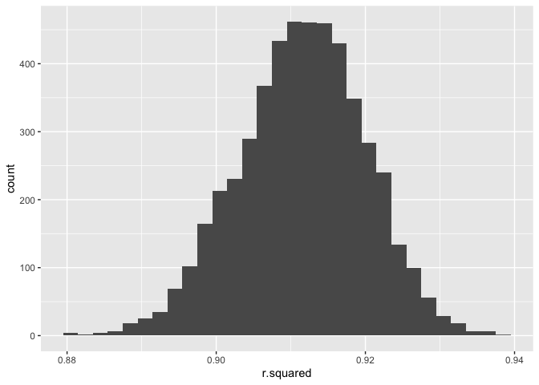

p8105_hw6_yy3563
================
Yifei Yu
2024-11-20

``` r
library(tidyverse)
```

    ## ── Attaching core tidyverse packages ──────────────────────── tidyverse 2.0.0 ──
    ## ✔ dplyr     1.1.4     ✔ readr     2.1.5
    ## ✔ forcats   1.0.0     ✔ stringr   1.5.1
    ## ✔ ggplot2   3.5.1     ✔ tibble    3.2.1
    ## ✔ lubridate 1.9.3     ✔ tidyr     1.3.1
    ## ✔ purrr     1.0.2     
    ## ── Conflicts ────────────────────────────────────────── tidyverse_conflicts() ──
    ## ✖ dplyr::filter() masks stats::filter()
    ## ✖ dplyr::lag()    masks stats::lag()
    ## ℹ Use the conflicted package (<http://conflicted.r-lib.org/>) to force all conflicts to become errors

``` r
library(broom)
library(modelr)
```

    ## 
    ## Attaching package: 'modelr'
    ## 
    ## The following object is masked from 'package:broom':
    ## 
    ##     bootstrap

## Problem 1

``` r
weather_df = 
  rnoaa::meteo_pull_monitors(
    c("USW00094728"),
    var = c("PRCP", "TMIN", "TMAX"), 
    date_min = "2017-01-01",
    date_max = "2017-12-31") %>%
  mutate(
    name = recode(id, USW00094728 = "CentralPark_NY"),
    tmin = tmin / 10,
    tmax = tmax / 10) %>%
  select(name, id, everything())
```

    ## using cached file: /Users/fifi/Library/Caches/org.R-project.R/R/rnoaa/noaa_ghcnd/USW00094728.dly

    ## date created (size, mb): 2024-10-29 11:14:02.944452 (8.656)

    ## file min/max dates: 1869-01-01 / 2024-10-31

``` r
set.seed(123)
boot_sample = function(df) {
  
  boot_df = 
    sample_frac(df, replace = TRUE) 
  
  return(boot_df)
  
  }
boot_straps =
  tibble(
    strap_number = 1:5000
  ) |> 
  mutate(
    strap_sample = map(strap_number, \(i) boot_sample(df = weather_df)),
    models = map(strap_sample, \(strap_df) lm(tmax ~ tmin, data = strap_df)),
    results = map(models, broom::tidy),
    results2 = map(models, broom::glance)
  )

boot_results =
  boot_straps |> 
  select(strap_number, results, results2) |> 
  unnest(results2) |> 
  select(strap_number, r.squared, results) |> 
  unnest(results) |> 
  group_by(strap_number, r.squared) |> 
  summarize(logbeta=log(prod(estimate)), .groups="drop")
```

``` r
boot_results |> 
  ggplot(aes(x = r.squared)) + 
  geom_histogram()
```

    ## `stat_bin()` using `bins = 30`. Pick better value with `binwidth`.

<!-- -->

``` r
boot_results |> 
  ggplot(aes(x = logbeta)) +
  geom_histogram()
```

    ## `stat_bin()` using `bins = 30`. Pick better value with `binwidth`.

<!-- -->

Both distributions are approximate normal. These distributions indicate
a reliable linear relationship between `tmin` and `tmax`, both in terms
of explained variance and the model coefficients.
